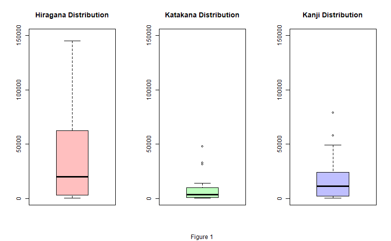
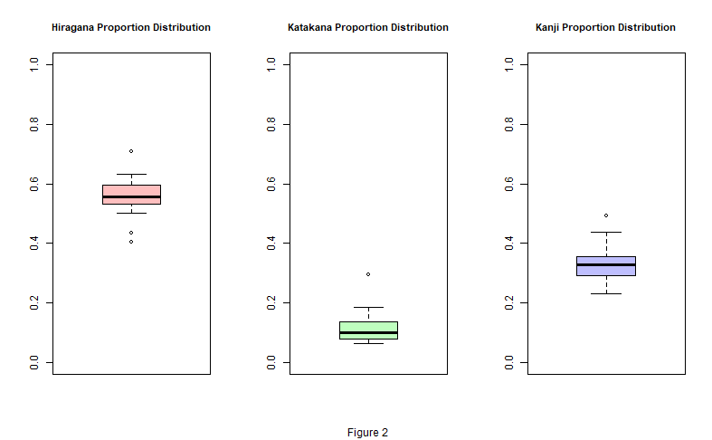
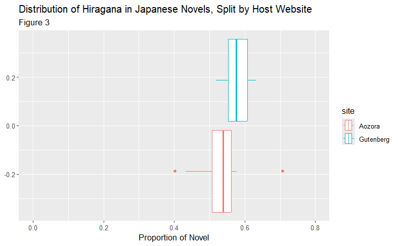
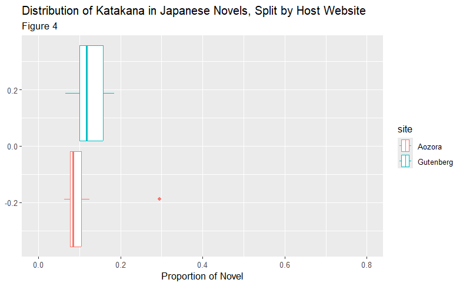
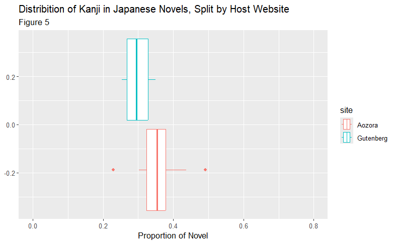
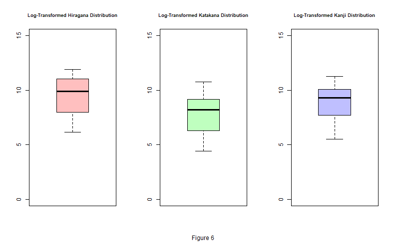

```{r setup, include=FALSE}
knitr::opts_chunk$set(echo = TRUE)
```

## Abstract
In Japanese, there are three main writing systems: Hiragana, Katakana, and Kanji. Hiragana and Katakana are both phonetic-based (i.e., every character represents a sound), while Kanji (the writing system borrowed from Chinese) is pictorial (i.e., each character represents a concept). While each writing system represents the same set of sounds, for individuals learning how to read in Japanese, it is often confusing to know which writing system to learn first. Should an individual's goal in learning Japanese be to read novels, it is interesting to know what writing system one would encounter the most—as to most efficiently tailor their learning experience to meet their goals. 

Thus, we plan to sample 20 books from the online sources Gutenberg and Aozora to analyze the overall distribution of Hiragana, Katakana, and Kanji within them. 

## Introduction
The purpose of this analysis is to examine the distribution of the three main Japanese writing systems: Hiragana, Katakana, and Kanji in the novels we obtained from the online libraries Gutenberg and Aozora. Specifically we aim to determine whether the frequency of each writing system differs between texts originally written in Japanese(found in Aozora), and works translates into Japanese(found in Gutenberg). 

  With this analysis, we are trying to answer the question that is: How do the distributions of Hiragana, Katakana, and Kanji differ between original Japanese novels and translated Japanese novels? By addressing this question, we provide insights for Japanese language learners who want to mainly focus their studies on the writing system most relevant in the type of novels they intend to read.
  
  This analysis may benefit translators, linguists, and language learners. As it offers factual data on writing system usage in Japanese literature. In terms of methodology, we are performing a comparative analysis bt sampling and classifying characters in each test according to their writing system. This allows us to classify and compare patterns in the writing system, providing a clear image of how different types of text utilize Hiragana, Katakana, Kanji.


## Part 1: Data 

For this project, we will observe several novels from both the [Gutenberg](www.gutenberg.org) website and the [Aozora](https://www.aozora.gr.jp/.) website. Gutenberg is an English-based online library consisting of several eBooks in the public domain. Likewise, Aozora is a Japanese-based online library serving the same purpose. 

We chose these sites due to the types of literature within them. From what we observed, the Japanese selection on Gutenberg mostly consists of works translated TO Japanese, while Aozora mostly consists of works written ORIGINALLY in Japanese. Thus, collecting a sample from both of the sites can provide insights as to how the distribution of each of the three writings systems differ between originally-Japanese works and works translated to Japanese. 

We randomly selected 10 novels from both websites. However, this was done differently for both websites. For the noveles on the Gutenberg website, a simple random selection of all the Japanese language books on the site was conducted.
However, this was not necessarily possible on Aozora—as the only way to see a masterlist of all of the novels is through sorting by authors. Thus, we ran a SRS on the authors that are not under copyright, and randomly select one of their novels (if they have multiple novels listed under their authorship).

The novels we ended up selecting  (and their file names) are the following: 

From Gutenberg:

| File Name | Novel Name | Author | Novel Source |
| --- | --- | --- | --- |
| "pg36358.txt" | お目出たき人 | Saneatsu Mushanokoji | https://www.gutenberg.org/ebooks/31757 |
| "pg37605.txt" | 羹 | Jun'ichiro Tanizaki | https://www.gutenberg.org/ebooks/36459 |
| "pg34084.txt" | 幽霊書店 | Christopher Morley | https://www.gutenberg.org/ebooks/41325 |
| "pg37626.txt" | 下宿人 | Marie Belloc Lowndes | https://www.gutenberg.org/ebooks/32978 |
| "pg31757.txt" | 友情 | Saneatsu Mushanokoji | https://www.gutenberg.org/ebooks/33307 |
| "pg36459.txt" | 刺靑 | Jun'ichiro Tanizaki | https://www.gutenberg.org/ebooks/31617 |
| "pg41325.txt" | 火星の記憶 | Raymond F. Jones | https://www.gutenberg.org/ebooks/36358 |
| "pg32978.txt" | 惡魔 | Jun'ichiro Tanizaki | https://www.gutenberg.org/ebooks/37605 |
| "pg33307.txt" | 法螺男爵旅土産 | Kuni Sasaki | https://www.gutenberg.org/ebooks/34084 | 
| "pg31617.txt" | 續惡魔 | Jun'ichiro Tanizaki | https://www.gutenberg.org/ebooks/37626 |

---

From Aozora:

| File Name | Novel Name | Author | Novel Source |
| --- | --- | --- | --- |
| "onnano_kao.txt" | 人間の本性 | Shin, Katakami | https://www.aozora.gr.jp/cards/000492/card42252.html |
| "ningenno_honsho.txt" | 化学改革の大略 | Shimizu, Usaburo | https://www.aozora.gr.jp/cards/001508/card51403.html |
| "kagaku_kaikakuno_tairyaku.txt" | 枯尾花 | Sekine, Mokuan | https://www.aozora.gr.jp/cards/001358/card49253.html |
| "kareobana.txt" | 将棋の話 | Shigeru, Tonomura | https://www.aozora.gr.jp/cards/001499/card52185.html |
| "shogino_hanashi.txt" | 色盲検査表の話 | Shinobu, Ishihara | https://www.aozora.gr.jp/cards/001742/card55751.html |
| "shikimo_kensahyo.txt" | 父八雲を語る | Iwao, Inagaki | https://www.aozora.gr.jp/cards/001961/card58832.html |
| "chichi_yakumoo_kataru.txt" | おくのほそ道 | Matsuo, Basho | https://www.aozora.gr.jp/cards/002240/card61619.html |
| "02okunohosomichi.txt" | 青バスの女 | Tatsuno, Kyushi | https://www.aozora.gr.jp/cards/001782/card56514.html |
| "ao_basuno_onna.txt" | 古事記物語 | Otomo, Yasumaro | https://www.aozora.gr.jp/cards/000107/card1530.html |
| "kojiki_monogatari.txt" | 女の顔 | Kuroda, Seiki | https://www.aozora.gr.jp/cards/000257/card1425.html |

---
## Part 2: Data Cleaning/Processing

In order to extract how many Hiragana, Katakana, and Kanji characters that a novel has, we first take a subset of entire `.txt` file that does not contain the header/footer information added by the novel's Host Website (Aozora or Gutenberg). Then, we iterated over each character in the novel, classified it as either Hiragana, Katakana, or Kanji (or skipped it if it was not a Japanese character), and added it to the total sum of the writing system that it was classified as. Finally, we recorded the derived sum of Hiragana, Katakana, and Kanji. 

This process was repeated for every novel in our sample. The Host Website, total number of characters, total number of Hiragana, Katakana, and Kanji in each novel, etc. was saved in the the table`jp_novels.csv`. A snippet of this table is provided below:


This table contained several variables. The following is a brief explanation of each:

1. `site`: factor. A variable describing which of the Host Website (Gutenberg or Aozora) the novel came from.

2. `body_chars_total`: numerical. Total number of characters in the actual text of the literature (excluding the characters found in the header/footer).

3. `kanji`: numerical. Total number of characters from the body that are in Kanji.

4. `hiragana`: numerical. Total number of characters from the body that are in Hiragana.

5. `katakana`: numerical. Total number of characters from the body that are in Katakana.

6. `japanese_total`: numerical. Total number of characters from the body that are in Japanese (`kanji` + `hiragana` + `katakana`).

7. `non_japanese`: numerical. Total number of characters from the body that are NOT in Japanese.

8. `removed_chars_header_footer`: numerical. Number of characters removed from the novel file as part of the header/footer.

9. `removed_ascii_english`: numerical. Number of Latin-script characters (ie, characters in English) that was removed from the novel file.

With this clean dataset, one is ready to perform analysis. 

## Part 3: Preliminary Analysis

After cleaning the data and organizing it into a single dataframe, we can begin with an investigation of the distributions of the three Japanese writing systems across the 20 sampled novels. This preliminary analysis aims to build an understanding for the structure of the data and to identify patterns that may explain and guide later procedures.

Firstly, since they are the basis of this project, it is imperative to observe the distributions of Hiragana, Katakana, and Kanji within the sample data:





Based on these charts, it is apparent that the distributions for each of the three writing systems are quite skewed right. While some novels carry very large counts of Hiragana, Katakana, and Kanji, most novels tend to have more adequate totals. This is expected because longer novels naturally contain more characters of every type. Compared to shorter works such as poems and essays, they contribute fewer overall characters. Even within this skewed formation, the spread of Katakana counts appears noticeably smaller than Hiragana or Kanji, suggesting a limited variable use of Katakana across sampled texts.

However, interpreting raw character counts can be misleading because novels differ greatly in length and density of Japanese text. A novel with twice as many total characters will naturally have higher counts of every writing system. To account for this, it is helpful to standardize the data by examining the proportion of Japanese characters belonging to each writing system rather than raw counts. By converting counts to percentages we can accurately compare patterns across texts of varying lengths and avoiding extremely long works to heavily influence the distribution.





Now that each writing  system is expressed as a proportion of a novels total Japanese characters, the differences become much clearer. The distribution of Hiragana appears to be fairly symmetric and centered—suggesting that Hiragana is used at consistent rates across the sampled texts. Given Hiragana's role in gramatical structure, this makes sense. Its usage tends to be stable regardless of genre or author.
  
The proportion of Katakana is much smaller on average and more close to zero than the other two distributions. Most of the novels use Katakana sparingly, likely because Katakana typically appears in specific contexts such as sound effects, foreign names, or emphasis. The mean Katakana proportion in the dataset is roughly 10%, supporting the claim that Katakana is the least commonly used of the three writing systems.

Kanji shows the widest range in proportional use. Some novels rely heavily on Kanji, especially older and more formal texts, while others include much lower Kanji density, depending on author style and intended genre. This variability suggests that Kanji usage depends on style of writing and could differ between translated works and originally Japanese works, making it a key variable for later comparison.

Additionally, these trends set the stage for the next stage of analysis: comparing the distributions of Hiragana, Katakana, and Kanji between texts hosted on websites such as Gutenberg (translates into Japanese) and Aozora(originally Japanese works). Differences observed here can reflect meaningful differences between translated and native literature.







Figures 3, 4, and 5 illustrate how the proportional usage of Hiragana, Katakana, and Kanji differs between Aozora and Gutenberg texts. The separation between the two groups is visually apparent. In the Hirigana distributions, Gutenberg novels tend to carry a slightly higher proportional range, while Aozora novels cluster lower. A similar pattern appears for Katakana, although both websites show low overall usage, the Gutenberg texts again display higher values, while Aozora texts remain tightly grouped toward the lower end. Figure 5 shows a similar pattern for Kanji proportions, though the separation between the two websites is more prominent. Gutenberg novels cluster within a narrower range, while Aozora novels span a wider range. Aozora texts tend to rely more heavily on Kanji than Gutenberg. These differences provide further evidence that the two sources represent distinct structural patterns.

With this preliminary analysis complete, it is now possible to move to more complicated analysis. 

## Part 4: Analysis:

The goal of this project is to determine if there are any significant differences in the distributions of Hiragana, Katakana, and Kanji within Japanese works. In order to definitively determine this, one can run a collection of two-sample t-tests between each of the three writing systems (i.e., comparing Hiragana and Katakana, Katakana and Kanji, and Hiragana and Kanji).

In addition, to determine if there is a significant difference between the distribution of the writing systems in originally-Japanese works and works translated to Japanese, one can run a two-sample t-test for each writing system on the novels that are from Aozora and the novels that are from Gutenberg.

Via these tests, it is possible to answer the questions that were proposed at the beginning of this report. 

### Part 4.1: Two-Sample T-Test for Difference in Writing System Distribution Means

According to [The University of Austin, Texas](https://sites.utexas.edu/sos/guided/inferential/numeric/onecat/2-groups/independent/two-sample-t/), in order to run a Two-Sample T-Test, there are some assumptions to be made:

1. Both datasets are normally distributed.

2. Each each observation in both datasets are independent.

3. The population variances of both datasets are equal.

Thus, in order to analyze whether or not there is a difference in the mean number of characters of these three writing systems within all of the gathered novels, it is important to verify these conditions hold.

Since each datapoint that we are using come from unique novels, and these novels were randomly selected from the greater selection of novels present in both Aozora and Gutenberg, it is safe to say that the observations in our compared datsets are independent.

However, according to the distributions seen in Figure 1, it is evident that the distributions of Hiragana, Katakana, and Kanji characters are extremely right-skewed—voiding the normality assumption required for the t-Test. In order to remedy this, we apply a log transformation to the measurements in question. The resulting distributions are the following:





After performing this transformation, the data seems to be far closer to the normal distribution than before. Thus, it is possible for the normalcy condition to be met, provide that these log-transformed values of Hiragana, Katakana, and Kanji counts are used for analysis instead of the original values.

Finally, one should check the variances of the log-transformed data. When calculated using the base-R function `var()`, the following results arose: 

- Hiragana: 3.143388 characters²

- Katakana: 3.148605 characters²

- Kanji: 2.71181 characters²

In this instance, the variances of the log-transformed Hiragana counts and log-transformed Katakana counts are extremely similar (differint by just over 0.005 characters²), while the variance of the log-transformed Kanji count is lower than both of them. This means that the variances of the transformed Hiragana and Katakana counts could be similar, while the variances of any combination with Kanji will not be similar.

In summary, using the log-transformation, it is reasonable to assume independence and normality (assumptions 1 and 2). However, it cannot be definitively assumed that the variances between each writing system are equal. 

To be safe, instead of the common Student's t-Test (which requires all three assumptions to be met in order to be accurate), one can use the Welch t-Test. This version of the t-Test still assumes normality and independence, but does NOT require equal variances between the two distributions in question. This version of the t-Test is perfect for our needs. 

With this preliminary screening complete, it is time to perform the Two-Sample T-Tests for Difference in Means. 

For each of these tests, the null hypothesis is that $\mu_1 = \mu_2$, and the alternate hypothesis is that $\mu_1 \neq \mu_2$. The results of these t-tests will be compared to an alpha level of $\alpha = 0.05$. 

To complete this step, we used the `t.test()` function in R—of which calculates The values of $\mu_1$ and $\mu_2$, as well as the results of these tests, are the following:

| Test # | Hiragana | Katakana | Kanji | 95% Confidence Interval | p-value | 
| ----- | -------- | -------- | --------- | -------------------- | ----- |
| 1 | $\mu_1$ | $\mu_2$ | N/A | [0.5098914, 2.7808238] | 0.005655 |
| 2 | $\mu_1$ | N/A | $\mu_2$ | [-0.5614726,  1.6296081] | 0.3299 |
| 3 | N/A | $\mu_1$ | $\mu_2$ | [-2.20732265, -0.01525716] | 0.04705 |

Based on these results, it seems that there is a statistically significant difference in the means between the distributions of Katakana and the remaining two writing systems. However, interestingly, there is no evidence to suggest that the the distributions of Hiragana and Kanji are different for Japanese novels obtained on Gutenberg and Aozora.

The positive values in the 95% Confidence Interval for Test 1 seems to suggest that the mean number of Hiragana characters is larger than the mean number of Katakana characters. Likewise, the negative values in the 95% Confidence Interval for Test 3 suggest a higher mean number of Kanji than Katakana characters. In hindsight, this result makes sense. According to [Tae Kim's online Japanese Learning resource "A Guide to Learn Japanese Grammar"](https://guidetojapanese.org/learn/category/grammar-guide/the-writing-system/), despite being a phonetic writing system like Hiragana, Katakana's main purpose is to translate western words into Japanese. This contrasts the wider usages of Hiragana and Kanji in Japanese, as both systems are essential for written grammar. Thus, since Katakana is used less often compared to both Hiragana and Kanji, it makes sense as to why the mean for Katakana is statistically lower than that of both Hiragana and Kanji. 

Hiragna and Kanji's use in written Japanese grammar also partially explains the lack of evidence against a difference in their means. If both writing systems are needed in order to write anything formally, it makes sense that they would be used at similar rates across all Japanese novels. 

While it is interesting to see how the distributions of Hiragana, Katakana, and Kanji differ in general, this analysis can be taken one step further. We will now see whether the distributions of characters in Japanese novels are different if they are sourced from Gutenberg or Aozora. 


### Part 4.2: Two-Sample T-Test for Difference in Hosting Website Distribution Means(Character Counts)

Once again, since we are taking a two-sample t-test, we must check if the assumptions stated previously are met. Each row in our dataset represents a different novel, so it is reasonable to assume independence. Secondly, total character counts may not be perfectly normal, but t-tests are robust with samples of this size. Finally, because the sample variances for Aozora and Gutenberg differ substantially (Aozora ≈ 9.35×10⁸ characters² vs. Gutenberg ≈ 5.17×10⁹ characters²), the equal-variance assumption is not satisfied. However, since Welch’s two-sample t-test does not require equal variances and each novel represents an independent observation, it is still appropriate to proceed with the test.

Based on the results of the Welch two-sample t-test, there is strong statistical evidence of a difference in the mean total number of characters between novels obtained from Aozora and those obtained from Project Gutenberg. The 95% confidence interval for the difference in means [−149,882.97, −42,401.83] does not contain zero, and the associated p-value of 0.00209 is far below our significance threshold of 𝛼=0.05. Together, these findings indicate that we reject the null hypothesis that the two websites produce novels with similar average lengths.

Furthermore, the sample means provide additional insight into the practical magnitude of this difference. Aozora novels in our sample contain an average of 17670.8 characters, while Gutenberg novels contain an average of 113,813.2 characters. This substantial gap suggests that, within the novels we collected, Gutenberg tends to host significantly longer works than Aozora. This aligns with the different literary focuses of the two platforms: Gutenberg primarily archives full-length Western novels, while Aozora includes a wider variety of Japanese texts, including shorter essays, folktales, and serialized literature.

Overall, the analysis demonstrates a clear and statistically significant difference in total character count between the two sources, with Gutenberg novels being markedly longer on average.

### Part 4.3 Two-Sample T-Test for Difference in Hosting Website Distribution Means(Writing Systems)

In addition to a generalized difference in mean characters, we analyzed whether the mean count of each writing system differs between the two sources.

As per before, we checked the assumptions needed to run a t-test. Each row represents a different novel, so the observations are independent. Secondly, raw writing-system counts may not be perfectly normal, but Welch’s t-test is robust for small sample sizes. Finally, we checked the variances between all 6 subsets:

| Writing System | Gutenberg Variance | Aozora Variance |
| --------- | ---------  | ---------  |
| Hiragana | 2504570454 | 562821344 | 
| Katakana | 251248916 | 4628510 |
| Kanji | 588466075 | 84030145 | 


The variances for Hiragana, Katakana, and Kanji all differ greatly between Aozora and Gutenberg, meaning the equal-variance assumption is not met. However, since Welch’s t-test does not require equal variances and the observations are independent, it is still appropriate to proceed.

Based on the results of the three Welch two-sample t-tests, there is strong statistical evidence that the mean counts of Hiragana, Katakana, and Kanji differ significantly between novels obtained from Aozora and those obtained from Project Gutenberg. In all three cases, the 95% confidence intervals for the difference in means do not contain zero, and each corresponding p-value falls below the significance threshold of 𝛼=0.05. These results lead us to reject the null hypotheses across all writing systems and conclude that the average number of characters in each category is significantly different between the two websites.

The direction and magnitude of these results provide further meaningful insight. For Hiragana, the Gutenberg novels contain substantially more characters on average (64,849.6) than the Aozora texts (11,958.7). A similar pattern appears in the Katakana counts, where Gutenberg again shows much higher averages (15,947.7) compared to Aozora (1,446.7). Finally, the Kanji counts follow the same trend, with Gutenberg novels averaging 32,547.3 characters versus 6,277.2 in Aozora. In every writing system examined, Gutenberg novels exhibit dramatically higher usage than their Aozora counterparts.

These results reflect structural differences in how each platform curates its literary collections. Since Gutenberg primarily archives long-form Western works translated into Japanese, it is expected that such texts would contain large quantities of Hiragana, Katakana, and Kanji. In contrast, Aozora includes a wider variety of Japanese writings—including essays, folktales, children’s stories, and serialized pieces, many of which are shorter in length. The consistently lower writing-system counts in Aozora, therefore, align with the differences in composition and average text length observed between the two sources.

Overall, the statistical evidence shows that Gutenberg novels contain significantly more Hiragana, Katakana, and Kanji characters than Aozora novels, reinforcing the broader conclusion that Gutenberg’s texts are substantially longer and compositionally denser across all major Japanese writing systems.

| Test # | Writing System | Mean (Aozora) | Mean (Gutenberg) | 95% Confidence Interval            | p-value   |
|-------|----------------|----------------|-------------------|------------------------------------|-----------|
| 1     | Hiragana       | 11,958.7       | 64,849.6          | [-90,772.34, -15,009.46]           | 0.009965  |
| 2     | Katakana       | 1,446.7        | 15,947.7          | [-25,882.305, -3,119.695]          | 0.01792   |
| 3     | Kanji          | 6,277.2        | 32,547.3          | [-44,220.753, -8,319.447]          | 0.007955  |

## Part 5: Conclusion

 The purpose of this analysis was to determine whether statistically significant differences exist in writing system usage such as Hiragana, Katakana, and Kanji both within Japanese novels and between novels sourced from websites Aozora and Gutenberg. After applying appropriate data cleaning, using log transformed data, and Welch two sampled t-tests, we evaluated differences in mean character counts while accounting for independence, skewed distributions and unequal variances. 
  When testing whether the mean counts of Hiragana, Katakana, and Kanji differed across the entire collection of novels, we found significant information. Comparing Hiragana and Katakana, a 95% confidence interval of [0.5099,2.7808] and a p-value of 0.00565, indicating a statistically significant difference in mean usage between the two systems. The positive interval suggests that Hiragana occurs more frequently than Katakana on average. When comparing Hiragana and Kanji, the 96% confidence interval of[-0.5615, 1.6296] and a p-value of 0.3299 show no statistically significant difference between their mean usages. When comparing Katakana and Kanji, a confidence interval of [-2.2073,-0.0153] was produced with a p-value of 0.04705, indicating a statistically significant difference, with Kanji occuring more frequently than Katakana. These results suggest that Katakana is used significantly less often compared to Hiragana and Kanji. 
  After testing character counts, strong evidence of a difference in total character count between Aozora and Project Gutenberg novels was found. The 95% confidence interval [-149,882.97,-42,401.83] excludes zero, with a p-value of 0.00209, leads us to reject the null hypothesis of equal mean lengths. It is evident that Gutenberg hosts significantly larger works. Overall, the test confirms a clear difference in novel length between the two sources.
  Once testing writing systems, significant differences in counts in the three writing systems were found between Aozora and Gutenberg novels. All 95% confidence intervals exclude zero, along with all p-values below 0.05, leading us to reject the null hypothesis. Gutenberg novels have much higher averages, reflecting that Gutenberg hosts longer and full length works, while Aozora includes shorter texts. This confirms that Gutenberg texts are longer and denser across all major Japanese writing systems.
  It is interesting to note that Katakana is consistently less frequent than both Hiragana and Kanji. Future steps could include analyzing other collections of texts such as news articles and screenplays examining changes in writing systems in different genres and usage over time. By doing so we can better understand stylistic trends in Japanese writings.

## Part 6: Team Member Contributions
1. Pankshi Parekar: Created/Organized the GitHub repository. Created/Organized the Final Report. Ran the Simple Random Selections for choosing the novels for analysis, and prepared the `data` folder in the GitHub repository accordingly. Wrote the Abstract, as well as parts 1, 3, 4.1, and the opening of section 4 in the report. Created Figures 1-6.

2. Isabella Perez: Wrote the Introduction and Conclusion sections of the report, as well as parts 3.

3. Ulices Ramirez Lopez:  Built an R Markdown workflow to automatically clean the Japanese text files from Aozora and Gutenberg. The main goal was to remove unnecessary parts like headers, footers, and any non-Japanese or English characters. Did this by reading each .txt file, converting the text to UTF-8, cutting out lines before and after certain markers (like ----- and 底本：), and deleting inline Aozora markup such as ［＃...］, 《...》, and ｜. After cleaning, the script counted only Japanese characters (kanji, hiragana, and katakana) to measure how much of the text remained. Finally, it saved two CSV summaries, one for Aozora and one for Gutenberg — showing the cleaned results for each file. To analyze differences between Japanese texts hosted on Aozora and Project Gutenberg, I conducted a series of Welch two-sample t-tests, saved as separate R Markdown files in the T-Tests folder, and then incorporated their conclusions into the final report. First, I ran three t-tests comparing the mean counts of Hiragana, Katakana, and Kanji characters between the two websites. In addition to these, I performed a separate t-test on the total number of characters per novel, treating it as an overall measure of text length. In all cases, the variances between Aozora and Gutenberg differed substantially, so Welch’s t-test—which does not assume equal variances—was used. The results showed statistically significant differences for each writing system and for total character count, with Gutenberg novels consistently containing far more Hiragana, Katakana, Kanji, and overall characters than Aozora novels. These findings were summarized in tables and integrated into the final report, supporting the conclusion that Aozora and Gutenberg host structurally different types of Japanese texts, with Gutenberg’s works being significantly longer and denser.


